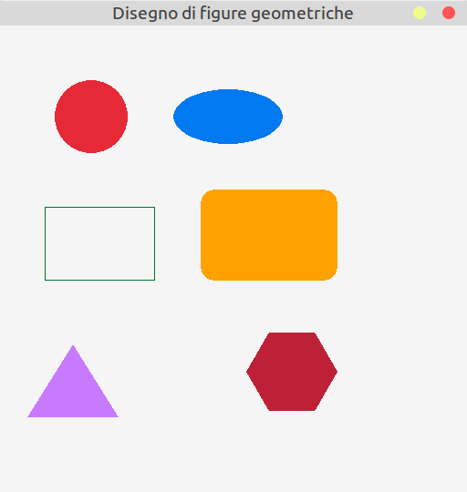

# Disegno di figure geometriche

Raylib mette a disposizione diverse funzioni per disegnare
figure geometriche di base. Queste primitive sono molto utili
per prototipi, giochi 2D, visualizzazioni e per comprendere
il funzionamento delle coordinate sullo schermo.

In questa lezione vengono mostrate le funzioni:

- `DrawCircle`
- `DrawEllipse`
- `DrawRectangleLines`
- `DrawRectangleRounded`
- `DrawTriangle`
- `DrawPoly`

---

## Cerchi

Per disegnare un cerchio si utilizza la funzione:

```c
DrawCircle(int centerX,
           int centerY,
           float radius,
           Color color);
```
dove i due parametri `centerX` e `centerY` sono le coordinate del centro,
`radius` è il raggio e `color` è il colore.

---

## Ellissi

Per disegnare un'ellisse si utilizza la funzione:

```c
DrawEllipse(int centerX,
            int centerY,
            float radiusX,
            float radiusY,
            Color color);
```
dove i due parametri `centerX` e `centerY` sono le coordinate del centro,
`radiusX` è la lunghezza dell'asse x, `radiusX` è la lunghezza dell'asse y  
e `color` è il colore.
---

## Rettangoli (solo contorno)

Tutte le versioni 'semplici' delle funzioni per il disegno di figure
prevedono il disegno di una figura piena, cioè il cui interno
è colorato. Se si volesse disegnare solo il contorno, esistono le 
corrispondenti funzioni che hanno lo stesso nome delle versioni
semplici, con in più il suffisso `lines`. In questo esempio viene mostrata 
con i rettangoli, ma la stessa idea si può applicare a qualsiasi forma.

```c
DrawRectangleLines(int x,
                   int y,
                   int width,
                   int height,
                   Color color);
```
Il significato dei parametri è il solito.

---

## Rettangoli con angoli arrotondati

Per disegnare un rettangolo con i bordi arrotondati si utilizza la funzione:

```c
DrawRectangleRounded(Rectangle rect,
                     float roundness,
                     int segments,
                     Color color);
```
Stavolta il primo parametro è un `Rectangle`. Senza entrare nel dettaglio
di cosa sia da un punto di vista del linguaggio, lo si può pensare come
un *pacchetto* che contiene al suo interno più variabili, in questo caso
x, y, width e height, con il solito significato. Il vantaggio in questo
caso è di dover passare alla funzione un solo parametro di tipo `Rectangle`
anzichè quattro parametri separati, che renderebbeero pesante la firma della
funzione.
Per gli scopi di questa lezione è sufficiente sapere che la dichiarazione
di un `Rectangle` e la concomitante inizializzazione vanno fatte in questo modo:

```c
Rectangle rect = { x, y, width, height };
```

Il successivo parametro è la `roundness`, che varia da 0 a 1, dove 0 vuol dire senza
nessun vertice arrotondato, 1 con i vertici così arrotondati che diventano dei
semicerchi sul lato più corto e i valori intermedi che dicono quanto sono grandi i vertici
arrotondati rispetto al lato (in generale valore più basso, vertici arrotondati più piccoli).
Il parametro `segments` è in relazione con il modo con cui vengono disegnati gli arrotondamenti,
in generale 8 è un valore sempre adeguato e `color` è, come al solito, il colore della
figura.
---

## Triangoli

Per disegnare un triangolo si si utilizza la funzione:

```c
DrawTriangle(Vector2 v1,
             Vector2 v2,
             Vector2 v3,
             Color color);
```
Anche in questo caso la libreria definisce un tipo di dato `Vector2` che contiene
la x e la y di un punto, per dover passare solo tre `Vector2` anzichè sei parametri
separati, cioè le x e le y di ogni vertice.

```c
Vector2 p = {100, 50};
```

---

## Poligoni

Per disegnare un poligono regolare di **n** lati, si utilizza la funzione:

```c
DrawPoly(Vector2 center,
         int sides,
         float radius,
         float rotation,
         Color color);
```

dove `center` è il centro del poligono, `sides` il numero di lati, `radius`
il raggio del cerchio circoscritto, quindi la sua "dimensione", `rotation`
la rotazione in gradi rispetto alla versione 'normale' e `color` il
colore della figura.

---

L'esecuzione del programma creerà questa finestra:

