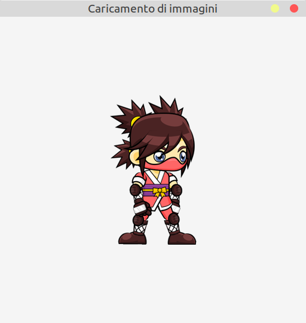

# Caricamento di immagini

Il modo più semplice per caricare un'immagine in Raylib è di utilizzare
la funzione `LoadTexture`, a cui come parametro deve essere passato il nome
dell'immagine da caricare, in questo modo:

```c++
Texture2D img = LoadTexture("assets/image.png");
```

Di questa riga è importante sapere:

-   la variabile `img` è di tipo `Texture2D`: come già visto per `Rectangle` o `Vector2`,
non è importante sapere cosa sia esattamente, basta sapere come utilizzarlo nella chiamata alla successiva chiamata alla funzione di disegno
-   il parametro passato, cioè il nome del file, deve poter essere *visibile* dall'eseguibile. In questo esempio
l'immagine `image.png` deve trovarsi nella cartella `assets` che deve trovarsi nella stessa cartella dell'eseguibile.
A seconda di come sono strutturati i file CMakeLists, questo effetto lo si può ottenere in modi diversi, in questo
repository avviene automaticamente al momento della compilazione dell'eseguibile, tramite delle istruzioni opportune,
che non sono rilevanti ai fini di imparare come funziona questa libreria
-   se il caricamento fallisse, la libreria non porterà alla terminazione del programma, ma si limiterà a stampare
in *console* una riga come la seguente:
  
    ```text 
    WARNING: FILEIO: [assets/image.png] Failed to open
    ```
    
    I motivi che potrebbero causare questo comportamento e che vanno corretti se si vuole visualizzare l'immagine, generalmente possono essere i seguenti:
     - il file non esiste o ha un altro nome
     - il file esiste, ma non è nel percorso corretto rispetto all'eseguibile
     - il file ha un formato che la libreria non è in grado di gestire. Per gli scopi di queste lezioni verrà utilizzato solo il formato PNG, in quanto sicuramente supportato. In caso si volessero caricare immagini in altri formati, la cosa più semplice è quella di convertirli prima in PNG.
       
- l'immagine deve essere caricata una sola volta anche se si volesse disegnarne più copie a video, quindi è **molto importante** che l'istruzione venga eseguita prima di entrare nel *main loop*, per evitare il caricamento di 
copie multiple, con buona probabilità di *crash* del programma

Se il caricamento è andato a buon fine, nella parte di disegno del *main loop* è sufficiente chiamare la 
funzione `DrawTexture` con i seguenti parametri:

```c++
DrawTexture(Texture2D texture,
         int posX,
         int posY,
         Color tint);
```

dove il primo parametro è la *texture* da mostrare a video, quella caricata in precedenza,
il secondo e il terzo sono le coordinate dove verrà posizionato l'angolo in alto a sinistra dell'immagine e l'ultimo è il colore di "sfondo": se, come in questo esempio,
il colore viene impostato a `WHITE`, l'immagine avrà i colori originali, con altri colori invece avverrà un *mescolamento*, facendo quindi virare i colori dell'immagine
verso il colore passato come parametro.

Nel codice di esempio la chiamata avviene in questo modo:

```c++
DrawTexture(img, 
        (screenWidth - img.width) / 2, 
        (screenHeight - img.height) / 2, 
        WHITE);
```

La posizione è stata calcolata utilizzando sia le dimensioni dello schermo che dell'immagine per poterla
mostrare al centro della finestra. Come si può notare, la variabile `img` presenta due proprietà, `width` e 
`height` che sono la larghezza e l'altezza dell'immagine caricata: cambiando l'immagine anche questi due
valori potrebbero cambiare e la formula farebbe comunque in modo che l'immagine appaia al centro della finestra.

---

L'esecuzione del programma creerà questa finestra:

