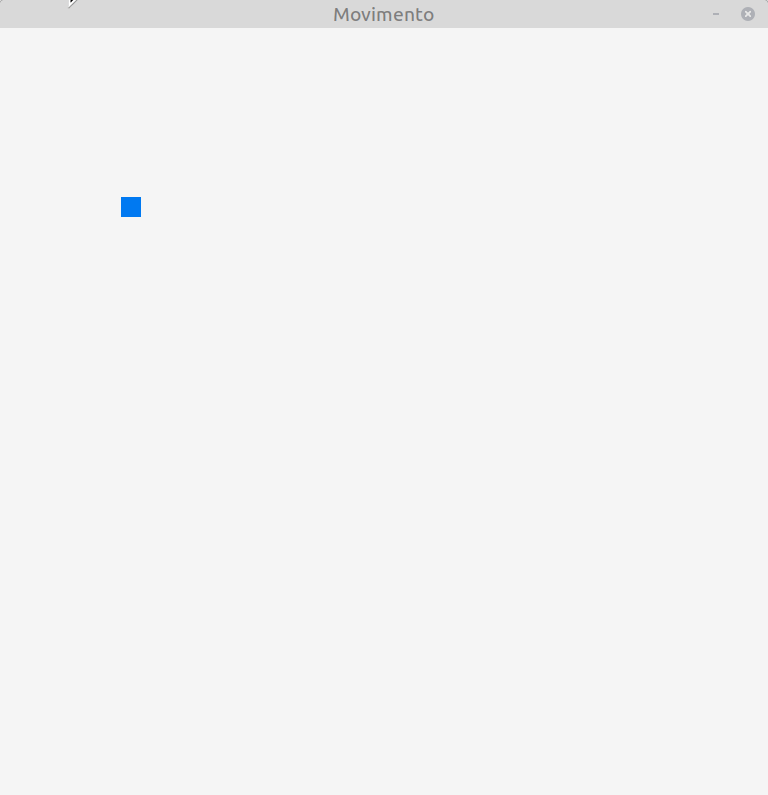

# Movimento

Per muovere qualsiasi tipo di oggetto (figure geometriche, testo, immagini, ...) 
all'interno di un programma, è necessario
che venga modificato il punto in cui questo viene disegnato. Questa modifica
farà in modo che venga percepito l'oggetto come se si "muovesse" sullo schermo

Sarà quindi necessario che all'interno del *main loop* ci sia una sezione dove
vengono aggiornate le coordinate dell'oggetto che si vuole muovere e un modo semplice
per mantenere i due aspetti di aggiornamento e disegno separati è quello di 
avere la prima parte del *main loop* dove si aggiorna lo stato degli oggetti,
in questo caso le coordinate, e una seconda parte dove avviene la fase di disegno,
che, come si è visto in precedenza, deve essere compresa tra le chiamate di `BeginDrawing`
e `EndDrawing`.

Il movimento più semplice possibile è quello lineare a velocità costante, che
in questo esempio viene ottenuto applicando la funzione `aggiorna` alle coordinate
dell'oggetto da muovere, che si è scelto essere un rettangolo.

Siccome la velocità non è altro che la variazione della posizione nel tempo,
è sufficiente aggiungere una quantità costante a una coordinata di posizione
per ottenere l'effetto di movimento a velocità costante.

Disegnando in 2D le coordinate che identificano la posizione di un oggetto
sono due, individuate nel programma dalle variabilili `x` e `y` e quindi 
anche le velocità saranno due, `vx` e `vy`, in modo che le velocità
lungo i due assi siano indipendenti tra loro e si possa quindi ottenere
un movimento lineare lungo qualsiasi direzione, a seconda dei 
valori di `vx` e `vy`: con i valori presenti nell'esempio, rispettivamente
0.5 e 0.7, il rettangolo si muoverà verso il basso e verso destra.

La funzione `aggiorna` riceverà le due coordinate di posizione per riferimento,
in modo che possa modificarle, e le due velocità verranno viceversa passate
per copia, poiché non devono essere modificate. 

```c++
void aggiorna(float &x, float &y, float vx, float vy) {
    x += vx;
    y += vy;
}
```
Come si può vedere, l'aggiornamento non farà altro che sommare alle coordinate
i valori delle velocità, causando quindi lo spostamento dell'oggetto.

Chiaramente valori maggiori delle velocità porteranno a un effetto 
visibile nel movimento dell'oggetto, che sarà quindi percepito
come più veloce.

Da notare che sia le coordinate che le velocità sono di tipo `float`,
nonostante il disegno richieda poi delle posizioni intere: questo permette
una maggiore flessibilità, nella gestione sia delle posizioni che delle
velocità, che potranno aumentare o diminuire in modo graduale e non "a salti"
come capiterebbe nel caso di variabili intere.

In questo esempio il rettangolo disegnato a un certo punto sparirà dallo schermo 
poiché le sue coordinate andranno oltre le dimensioni della finestra.

---

L'esecuzione del programma creerà questa finestra:


