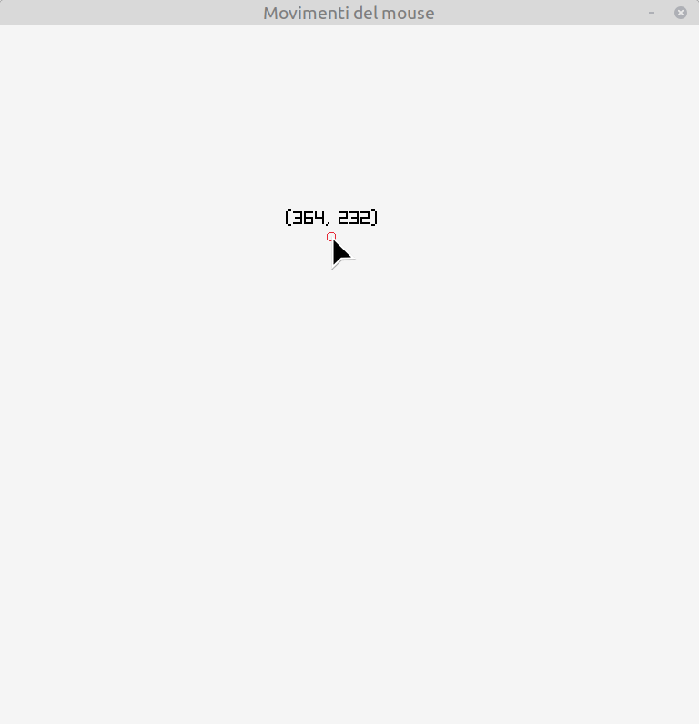

# Movimenti del mouse

Raylib mette a disposizione alcune funzioni semplici per leggere lo stato del mouse. In questa lezione si vedrà come:

- leggere la posizione del mouse sullo schermo

- visualizzare le coordinate vicino al puntatore

Per leggere la posizione del mouse è possibile utilizzare le funzioni `GetMouseX()` e `GetMouseY()`, 
rispettivamente per la coordinata orizzontale e verticale. Queste funzioni restituiscono dei numeri interi che rappresentano la posizione del mouse nella finestra.

Queste funzioni vanno chiamate nel *main loop*, in modo da sapere la posizione del mouse in ogni istante, per
poterne poi fare quello che si vuole nel programma.

In questo esempio si intende disegnare il testo con le coordinate leggermente sopra il puntatore del mouse, 
in modo da poterle visualizzare a schermo.

Per far questo verrà utilizzata la funzione `DrawText`, stando però attenti al fatto che questa funzione
richiede una stringa da disegnare, mentre le coordinate sono numeri interi.

Per "trasformare" le coordinate in una stringa, viene utilizzata la variabile `coordinate` nella quale,
tramite l'utilizzo della funzione `to_string` si ottiene una stringa della forma `(x, y)` in cui valore viene mantenuto aggiornato in base alle coordinate del mouse.

```c++
coordinate = "(" + std::to_string(mouseX) + ", " +
                        std::to_string(mouseY) + ")";
```
Per mantenere un corretto allineamento di questa stringa, considerando che la sua lunghezza è variabile in base
alle effettive coordinate del mouse, verrà utilizzata la funzione `MeasureText()` che restituisce la lunghezza della
stringa `coordinate` in pixel.

```c++
int l = MeasureText(coordinate.c_str(), 20);
```
Il valore contenuto in `l` sarà quindi la lunghezza in pixel della stringa contenuta il `coordinate` quando questa
stringa verrà visualizzata con dimensione 20.

A questo punto la chiamata di `DrawText` sarà la seguente:

```c++
DrawText(
            coordinate.c_str(),
            mouseX - l / 2,
            mouseY - 30,
            20,
            BLACK
        );
```

In questo modo il testo appare centrato sopra il puntatore del mouse.

---

L'esecuzione del programma creerà questa finestra:


