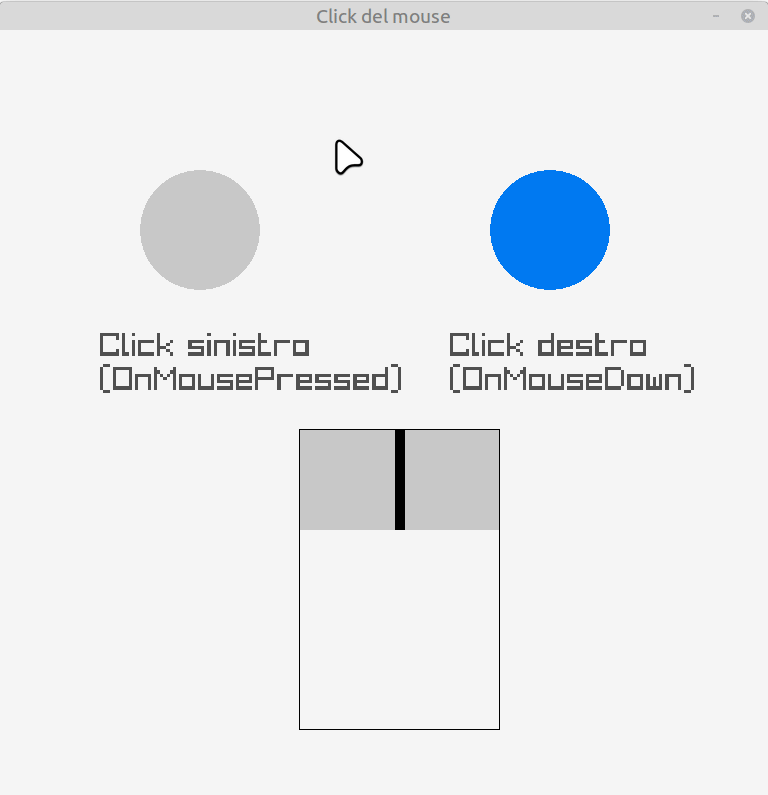

# Click del mouse

In questa lezione vediamo come leggere i **click del mouse** con Raylib.

L'obiettivo è capire:

- la differenza tra **tasto sinistro** e **tasto destro**
- la differenza tra le funzioni **IsMousePressed**, **IsMouseDown**, **IsMouseReleased** e **IsMouseUp**
- quando usare la coppia **Pressed/Released** anziché **Down/Up**

## Pulsanti del mouse

Raylib usa delle costanti per individuare i pulsanti del mouse,
in particolare per i due pulsanti principali sono definite così:

- `MOUSE_BUTTON_LEFT`
- `MOUSE_BUTTON_RIGHT`

Queste costanti vengono utilizzate per indicare quale 
tasto del mouse è quello che interessa.

## Le funzioni principali

Raylib mette a disposizione quattro funzioni fondamentali per ogni pulsante del mouse.

### IsMouseButtonPressed

La funzione

```cpp
IsMouseButtonPressed(bottone-scelto)
```

è una funzione *non-bloccante*, cioè quando chiamata verifica
se il ```bottone-scelto``` è stato premuto, ritornando
il valore *booleano* corretto, non fermando l'esecuzione del *main-loop*. 

Anche se il pulsante restasse premuto, restituirebbe `true` 
**una sola volta** alla prima esecuzione all'interno del *main-loop* ed è quindi  
utile per azioni che devono avvenire **una volta sola**,
come, ad esempio, sparare un singolo colpo, selezionare un oggetto
o aprire un menu. Il parametro `bottone-scelto` indica il bottone del 
mouse di cui si vuole sapere se è stato premuto e quindi, limitandosi 
ai due bottoni principali, avrà il valore `MOUSE_BUTTON_LEFT` o `MOUSE_BUTTON_RIGHT`

Si può pensare a questa funzione come la risposta alla domanda "È stato premuto il bottone del mouse?".

---

### IsMouseButtonDown

La funzione

```cpp
IsMouseButtonDown(bottone-scelto)
```

è una funzione *non-bloccante*, cioè quando chiamata verifica
se il ```bottone-scelto``` è premuto **al momento della chiamata**, 
ritornando
il valore *booleano* corretto, non fermando l'esecuzione del *main-loop*.
A differenza della funzione precedente, se il pulsante restasse premuto, restituirebbe `true`
**tutte le volte** in cui viene chiamata all'interno del *main-loop*,
ed è quindi 
utile per azioni **continue**,
come, ad esempio, trascinare un oggetto, implementare il disegno a tratto o 
caricare una barra di potenza.

Si può pensare a questa funzione come la risposta alla domanda "Il bottone del mouse è schiacciato in questo momento?".


---

### IsMouseButtonReleased, IsMouseButtonUp

Sono le funzioni "complementari" rispetto a quelle precedenti, legate al rilascio del 
bottone (*released*) o a verificare se il bottone *non* è premuto (*up*).

Nell'esempio sono presenti due cerchi, inizialmente di colore grigio e blu e lo scopo è evidenziare il diverso comportamento
di `IsMousePressed` e `IsMouseDown`, associando la prima azione al bottone e al cerchio di sinistra e la seconda
al bottone e al cerchio di destra. In entrambi i casi la pressione del bottone comporterà il cambiamento di colore,
ma nel primo caso agirà come un interruttore della luce, mentre il secondo come il tasto di un campanello. 

## Utilizzo di `IsMouseButtonPressed`

Questa funzione viene utilizzata nel *main-loop* per gestire il *flag* `on`, che simula se il primo
cerchio è "acceso" (giallo) o "spento" (grigio). Il codice che utilizza questa funzione è il seguente

```c++
if (IsMouseButtonPressed(MOUSE_BUTTON_LEFT)){
    if (on == false) {
        colore_cerchio1 = YELLOW;
        on = true;
    } else {
        colore_cerchio1 = LIGHTGRAY;
        on = false;
    }
}
```

Nel momento un cui il tasto sinistro del mouse viene schiacciato, lo stato viene commutato da `true` a 
`false` o viceversa e anche i colori del cerchio cambiano di conseguenza. Se anche il pulsante venisse
tenuto premuto, la condizione sarebbe falsa, poiché risulterà vera solo una volta e, finchè il tasto non 
verrà rilasciato, non potrà più tornare a essere vera.

L'effetto sarà quindi come l'interrutore di una lampadina, che premuto una volta la accende e premuto una
seconda volta la spegne, e così via.

## Utilizzo di `IsMouseButtonDown`

Questa funzione viene utilizzata nel *main-loop* per gestire colore del secondo cerchio, che
sarà blu se il tasto destro non è premuto e diventerà rosso solo fino a che il tasto rimarrà premuto.
Il codice che utilizza questa funzione è il seguente

```c++
if (IsMouseButtonDown(MOUSE_BUTTON_RIGHT)){
    colore_cerchio2 = RED;
} else {
    colore_cerchio2 = BLUE;
}
```

Nel momento un cui il tasto destro del mouse è schiacciato (*down*), il cerchio di destra diventa rosso, 
ma appena il pulsante è rilasciato ritorna a essere blu.

L'effetto sarà quindi come il suono di un campanello, che è attivo solo finché si tiene il bottone premuto
e si spegne appena si toglie il dito dal bottone.


Capire bene le differenze tra queste due funzioni è fondamentale per poter decidere qual è la più adatta
rispetto al risultato che si vuole ottenere.

Il resto del codice che disegna i rettangoli, serve solo a evidenziare nell'esecuzione quando i tasti sono premuti
e quindi non verrà discusso.

---

L'esecuzione del programma creerà questa finestra:




